# **Flutter Lab 4-1**

> A new Flutter project lab 4-1.

## **Getting Started**

### **Main.dart (_route name_)**

```dart
import 'package:flutter/material.dart';
import 'first_view.dart';
import 'second_view.dart';
import 'detail_view.dart';
import 'animation_hero_view.dart';
import 'todo_list_view.dart';
import 'pass_argument_view.dart';

void main() {
  runApp(MaterialApp(
    title: 'Named Routes Demo',
    initialRoute: '/',
    routes: {
      '/': (context) => FirstView(),
      '/second': (context) => SecondView(),
      '/detail': (context) => DetailView(),
      '/animation-hero': (context) => MainScreen(),
      '/detail-animation-hero': (context) => DetailScreen(),
      '/todos': (context) => TodoMainScreen(),
      '/pass-argument': (context) => PassArgument(),
    },
  ));
}
```

### **First Screen**

<div style="text-align: center">
  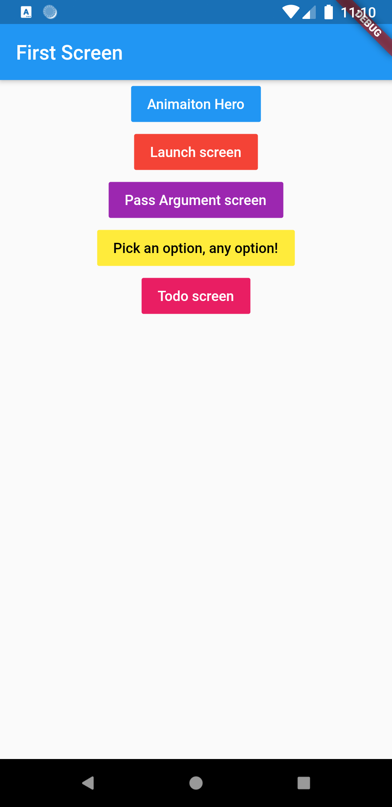
</div>

### **1. Animation Hero**

Click button **`Animation Hero`**, màn hình sẽ chuyển vào trang ảnh _(route /animation-hero)_. Click vào ảnh, hình ảnh sẽ được phóng to, click lại vào ảnh sẽ trở lại màn hình bình thường

<div style="text-align: center">
  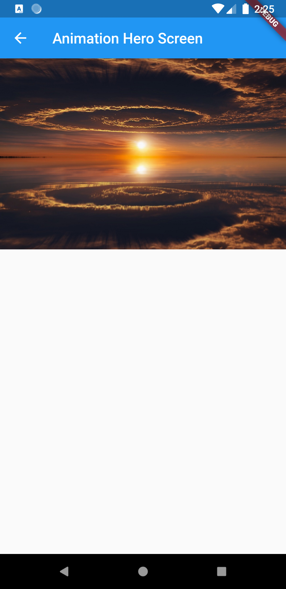
  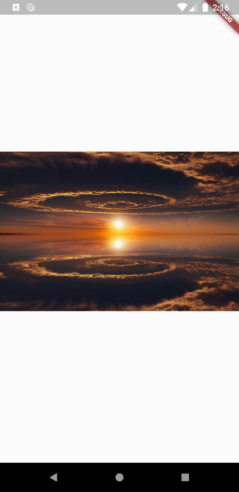
</div>

### **2. Navigate to a new screen and back (named routes)**

Click button **`Launch screen`**, màn hình sẽ chuyển vào trang **_Second Screen_** _(route /second)_.

Khi click button **`Go back first screen`** mà hình sẽ quay về trang **_First Screen_**

<div style="text-align: center">
  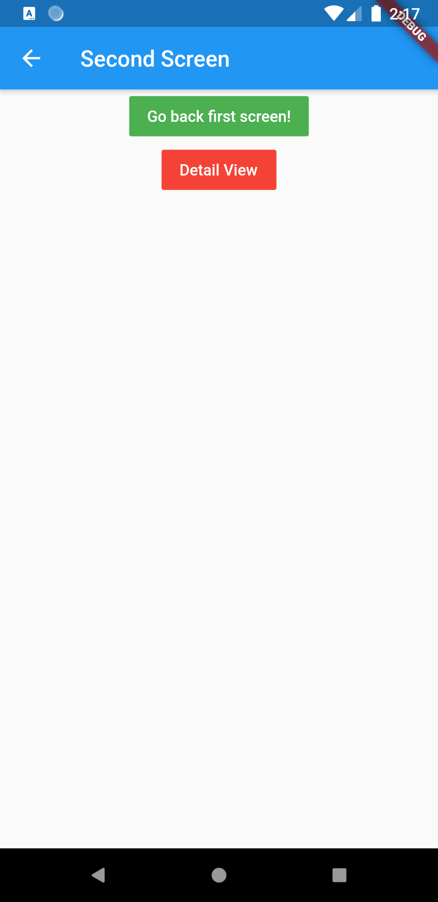
</div>

Click button **`Detail View`** sẽ chuyển đến trang **_Detail Screen_** _(route /detail)_

<div style="text-align: center">
  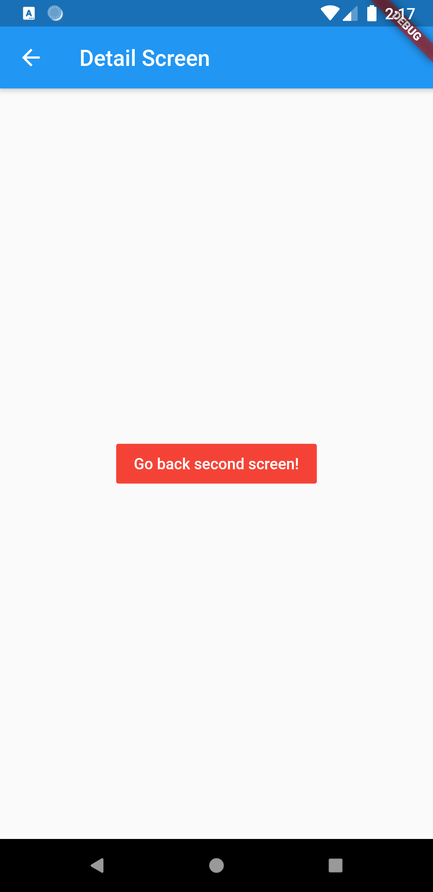
</div>

### **3. Pass arguments to a named route**

Click button **`Pass Argument screen`**, màn hình sẽ chuyển vào trang **_Pass Argument Screen_** _(route /pass-argument)_. Trong trang này có 2 nút **Dart** và **Flutter**, khi click vào 1 trong 2 nút này sẽ chuyển đến trang chi tiết, đồng thời tham số sẽ được truyền vào để giúp ta phân biệt được các trang với nhau.

Khi click button **`Go back first screen`** mà hình sẽ quay về trang **_First Screen_**

<div style="text-align: center">
  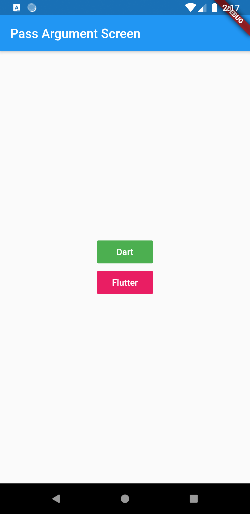
  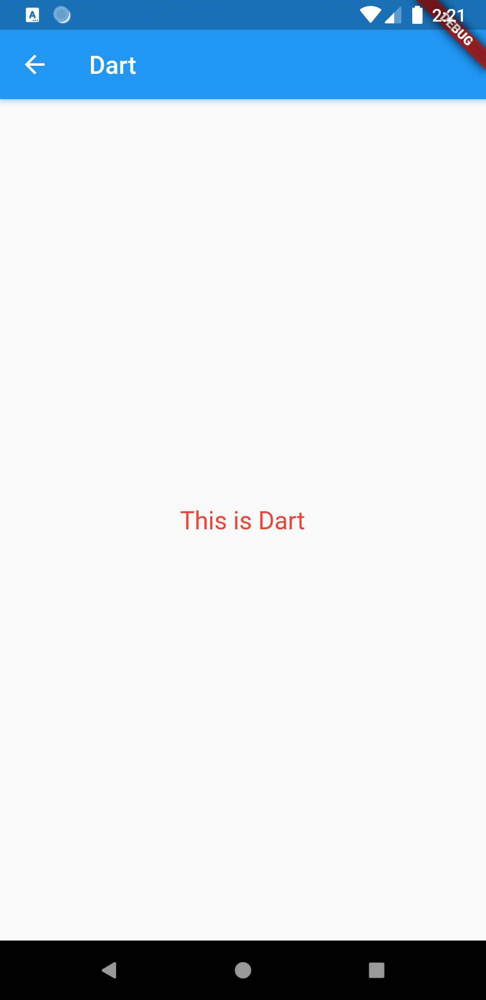
  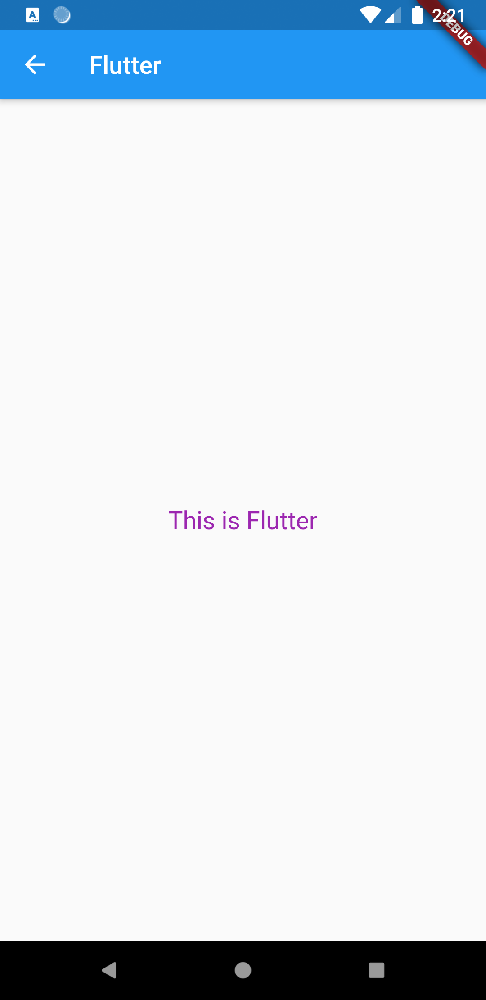
</div>

### **4. Return data from a screen**

Click button **`Pick an option, any option`**, màn hình sẽ chuyển vào trang **_Pick an option_**. Trong trang này có những option để bạn lựa chọn (**Yep!**, **Nope.**), khi click vào 1 trong những option này, màn hình sẽ quay về trang **_First Screen_**, đồng thời dữ liệu mà bạn lựa chọn cũng sẽ được chuyển đến, **_First Screen_** sẽ nhận dữ liệu và hiển thị dữ liệu vừa nhận dưới cuối màn hình.

<div style="text-align: center">
  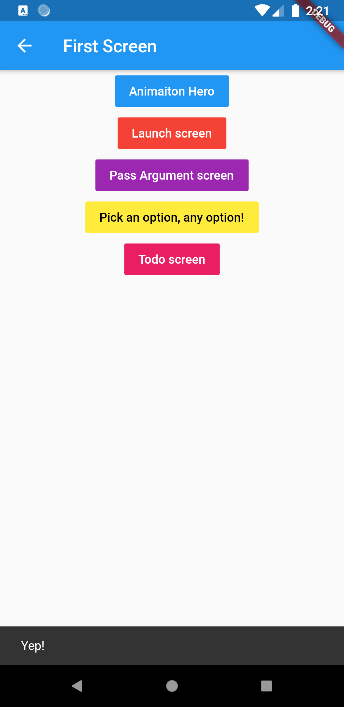
  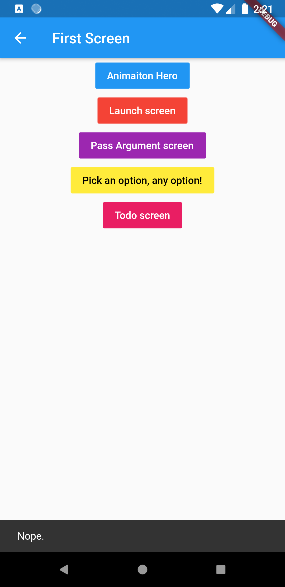
</div>

### **5. Send data to a new screen**

Click button **`Todo screen`**, màn hình sẽ chuyển vào trang **_Todo List_**. Trang này hiển thị 1 danh sách các công việc cần làm (VD: todo 1, todo 2,...).

<div style="text-align: center">
  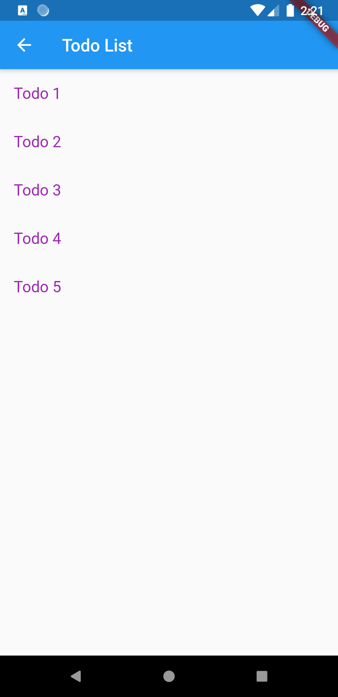
</div>

Khi click vào 1 **Todo** bất khi, màn hình sẽ chuyển vào trang chi tiết và hiển thị nội dung của công việc đó.

<div style="text-align: center">
  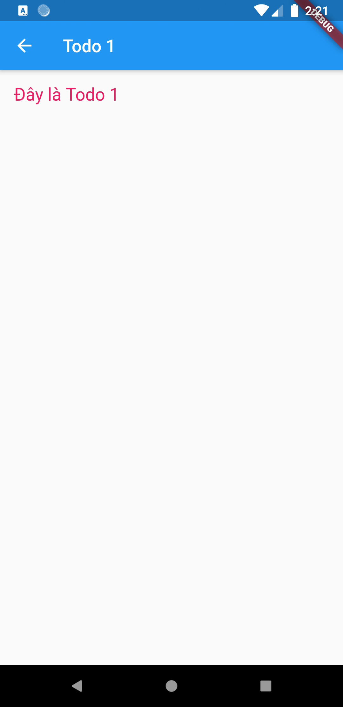
</div>

---

# Thanks For Watching
